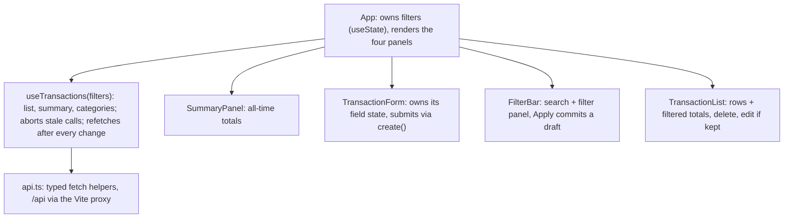

# Budget Tracker: Implementation Plan

This is the working plan for the Personal Budget Tracker take-home. It is the single source of truth for scope, decisions, and progress. Humans and AI agents both read and update it.

Last updated: 2026-09-30. Owner: Carlos.

## How agents use this file

Read this section before doing anything else.

1. Read `ai/CONVENTIONS.md`, then this file. CONVENTIONS wins on code style; this file wins on scope and decisions. If they conflict, add the conflict to Open questions. Known conflict until Phase 1 syncs CONVENTIONS: it still says to mirror types in `client/src/types.ts`; follow this file and use `@budget/shared`.
2. Claim before you start: set the phase's row in the Status table to `In progress (<agent>, <date>)`. Do not start a phase another agent has claimed.
3. Follow the phase's Tests first list: write the failing tests, make them pass, then refactor.
4. Tick a checklist item (`- [x]`) only after its check has actually passed.
5. Finish by setting the row to `Done (<date>)` and adding one line to the Progress log (date, agent, what changed, commit).
6. Decisions marked Accepted are settled. To change one, add it to Open questions and ask the human; do not edit the decision in place.
7. If reality differs from the plan (a version, a file name, a command), update the plan in the same commit as the code and note it in the Progress log.
8. Keep edits small and local to the section you touch. Do not reformat or reorder the file.
9. Write in plain ASCII punctuation: no em or en dashes, no curly quotes.

## Status

| Phase | Estimate | Status | Notes |
| --- | --- | --- | --- |
| 1. Scaffold the monorepo | 25 min | Not started | |
| 2. Domain model, schemas, and store | 30 min | Not started | |
| 3. REST endpoints | 30 min | Not started | |
| 4. React UI | 65 min | Not started | Pick the AI feature before starting; pick UI packages at the start |
| 5. AI enhancement | 45 min | Not started | Which AI feature: see Open questions |
| 6. README and WRITEUP | 25 min | Not started | |

## Open questions

- [x] Enhancement type: an AI feature (decided 2026-09-30).
- [ ] Which AI feature: decide before Phase 4 starts (about 1:25 on the timebox), so the form or filter panel leaves the right hook. Options and rules are in Phase 5; AI category suggestions is the recommendation.
- [ ] UI packages: decide at the start of Phase 4, from the shortlist there.

## Requirements from the brief

The PDF stays out of git, since it is the company's exercise. For local agents, drop a copy at `docs/BRIEF.pdf` (gitignored in Phase 1). This is the short version.

- Data model: `id` (auto-generated uuid), `date`, `description`, `amount` (positive number), `type` (`income` or `expense`), `category`. Any extension must be documented.
- API: `GET /api/transactions` with optional `type`, `category`, and `search` (matches description); `POST /api/transactions`; `PUT /api/transactions/:id`; `DELETE /api/transactions/:id`; `GET /api/summary` returning total income, total expenses, and net balance.
- Persistence: in-memory or a JSON file. A database is allowed but must be documented.
- UI: one page with a transaction list (with delete), an add form with client-side validation, a summary of income, expenses, and balance, and filters by type, category, and a text search on description. Accessibility basics matter: labels, focus states, semantic HTML.
- Enhancement: one meaningful feature beyond the core, documented and justified.
- Submission: a `README.md` that lets a reviewer run the app cold (with a `.env.example`), and a `WRITEUP.md` of about 400 to 600 words covering what was built and notable decisions, how AI tools were used (specifically), the enhancement and its value, and next steps.
- Constraints: 2 to 4 hours; runs locally, no deploy; no auth; a monorepo with `/client` and `/server`; do not over-engineer. Make reasonable calls on ambiguity and note them in the WRITEUP.
- Assessed on: full-stack fluency (typed contracts), React fundamentals, meaningful TypeScript, code quality, effective AI use, product thinking, and clear communication.

## Overview

Build it in six phases, about 3 hours 40 minutes of work, with the core app done by 2:30 and 20 minutes of buffer under the 4-hour cap.

Every choice below targets what the brief asks for: typed request/response contracts, state at the right level, TypeScript without `any`, reviewable code, specific evidence of AI use, a justified enhancement, and a concise writeup.

**Shape of the app**

- Server: `createApp(store)` in Express, three small routers, Zod at every boundary, and a store that works in memory and writes through to a JSON file.
- Client: one page, one data hook, typed fetch helpers, four components (summary, form, filters, list).
- Shared: a small workspace package, `@budget/shared`, holds the Zod schemas and inferred types that both apps import.
- Dev wiring: `pnpm dev` at the root runs both apps; Vite proxies `/api` to the server, so there is no CORS setup.

Out of scope, per the brief and CONVENTIONS: auth, deploy, a database, and DI containers, CQRS, or Clean Architecture layers.

**Working agreements**

- Tests first for schemas, store, routes, and the enhancement's core logic. The UI is verified by hand, including a keyboard-only pass.
- Commit at the end of every phase at minimum. Small commits double as evidence of process.
- Keep `ai/NOTES.md` as you go: one or two lines per phase on what the assistant was asked, what it got wrong, and how it was steered. The WRITEUP's AI section comes straight from it.
- The TakeHome folder is the repo root. CONVENTIONS calls it `budget-tracker/`, which works as the GitHub repo name.

**Timebox**

| Phase | Minutes | Starts | Ends |
| --- | --- | --- | --- |
| 1. Scaffold | 25 | 0:00 | 0:25 |
| 2. Model and store | 30 | 0:25 | 0:55 |
| 3. REST endpoints | 30 | 0:55 | 1:25 |
| 4. React UI | 65 | 1:25 | 2:30 |
| Checkpoint: core app done | | 2:30 | |
| 5. AI enhancement | 45 | 2:30 | 3:15 |
| 6. README and WRITEUP | 25 | 3:15 | 3:40 |
| Buffer | 20 | 3:40 | 4:00 |

If the core app is not done by about 2:30, take the cut list before starting the enhancement.

## Decisions

All accepted on 2026-09-30. Each one becomes a line in the WRITEUP.

| Question | Decision | Why, and the alternative | Status |
| --- | --- | --- | --- |
| Persistence | JSON file with an in-memory Map as the working set. Each write rewrites `server/data/transactions.json` (temp file, then rename). Path from `DATA_FILE`; tests stay in memory. | Survives `tsx watch` restarts and a reviewer's restart, with no database. Alt: memory only; simpler, but data resets on every restart. | Accepted |
| Seed data | When no data file exists, seed about 12 rows across this month and last. Delete the file to reset. | A cold start shows a working app and gives the enhancement real data. Alt: start empty. | Accepted |
| Money | `amount` is positive with at most 2 decimals; `type` carries the sign. Sum in integer cents. Show USD via `Intl.NumberFormat`. | Keeps the brief's `amount: number` and avoids 0.1 + 0.2 drift. Alt: integer cents in the API, which changes the brief's field. | Accepted |
| Dates | `YYYY-MM-DD` strings with no time or zone; real calendar dates only. The form defaults to today's local date. Future dates are allowed unless `ALLOW_FUTURE_DATES=false` is set in `server/.env`; the server's error then shows under Date. | Matches CONVENTIONS and avoids the UTC off-by-one. The flag blocks future dates without a code change. | Accepted |
| Category values | Free text, trimmed, 1 to 100 characters, compared case-insensitively. The form suggests presets and existing names via `<datalist>`. | The brief types it as a string. Alt: a fixed list; simpler, but no custom categories. | Accepted |
| Category filter options | Add `GET /api/categories` (distinct names), documented as an extension. | Keeps every option visible while the list is filtered on the server. Alt: presets plus names in the loaded rows; no new endpoint, but options shrink under a filter. | Accepted |
| Search, filters, order | Search on description stays visible (case-insensitive substring, debounced about 300 ms). A Filters panel adds type, category, amount range, and date range, applied with an Apply button. Ranges are inclusive, blanks mean no filter, and everything combines with AND. Sort by date, newest first, then most recently added. | Follows the familiar bank-style history screen: search plus a filter panel, all backed by query params. Its check-number range is left out because the model has no check numbers. | Accepted |
| Summary scope | `GET /api/summary` always returns all-time `totalIncome`, `totalExpenses`, and `netBalance`, plus a `filteredTotals` object with the same three fields for the query params sent. Those params use the same schema as `GET /api/transactions`; with none, `filteredTotals` equals the all-time totals. The panel shows the all-time totals, and a line above the list shows `filteredTotals`. | One request feeds both the panel and the filtered line, one query schema serves both endpoints, and the response shape never changes. Alt: send `filteredTotals` as null when no filters are passed. | Accepted |
| Update semantics | PUT replaces every editable field using the POST schema. `id` never changes; unknown keys are stripped; no PATCH. | One input schema, standard PUT meaning. | Accepted |
| Errors | 400 with Zod field errors for a bad body, query, or id format; 404 for a well-formed id that does not exist. Body: `{ error: { message, details? } }`. | Per CONVENTIONS; field errors map straight onto form fields. | Accepted |
| Editing in the UI | The brief's list only needs delete. If time allows, Edit loads a row into the same form and saves with PUT. | Puts PUT to use for little code, and it is the first UI feature to cut if time runs short. | Accepted |
| Shared types | A small `shared` workspace package (`@budget/shared`) holds the Zod schemas and the types inferred from them. `client` and `server` depend on it with `workspace:*`; it ships as TypeScript source, so there is no build step. | One source of truth: the form validates with the exact rules the server enforces, and a contract change fails both typechecks at once. Alt: mirror types in `client/src/types.ts`, the CONVENTIONS default, and accept drift risk. | Accepted |
| Runtime and install | Latest dependencies: every package added at `@latest` with the lockfile committed; as of 2026-09-30 that means Vite 8, React 19, Tailwind 4, Express 5, Zod 4, Vitest 5, and TypeScript 7. Runtime: Node 22 LTS in `.nvmrc`, matching the `engines` floor (`>=22.12`); newer Node releases also work. The newest pnpm is pinned via `packageManager`, and flagged build scripts are approved in `pnpm-workspace.yaml`. | The brief's README is only a template. Latest packages show current practice and the lockfile keeps installs repeatable. Node is the one thing a reviewer installs, so it stays on the LTS floor every tool supports. The Vite template still pins TypeScript 6.0; bump it, and fall back only if something breaks, noting it in the WRITEUP. | Accepted (revised after review) |

## Phase 1: Scaffold the monorepo (about 25 min)

Both apps start from one root command, and the page reaches the server through the Vite proxy. No domain code yet.

**Goals**

- A pnpm workspace with `client`, `server`, and `shared`; root scripts fan out with `pnpm -r`.
- Latest dependencies at `@latest` with the lockfile committed, on Node 22 LTS (`.nvmrc`) and the newest pnpm.
- `shared` (`@budget/shared`) is source-only: its `exports` point at `src/index.ts`, so Vite, tsx, and Vitest compile it and there is no build step. `client` and `server` depend on it with `workspace:*`.
- Server: Express with strict TypeScript, run by `tsx watch`. `app.ts` builds the app and `index.ts` only listens, so tests import the app without opening a port.
- Client: `pnpm create vite client --template react-ts`, then Tailwind v4 through `@tailwindcss/vite`. Delete the demo assets, keep the template's oxlint setup, and bump its TypeScript pin (6.0) to the latest.
- Vite proxies `/api` to `http://localhost:3001`, so the client uses relative URLs and the server needs no CORS.
- Vitest in `shared` and `server`, plus Supertest in the server, with a smoke test in each.
- Agent files: thin `AGENTS.md` and `CLAUDE.md` that point agents at `ai/CONVENTIONS.md`, this file (`docs/PLAN.md`), and the test commands, plus an empty `ai/NOTES.md` so AI use is logged from day one.
- Sync `ai/CONVENTIONS.md` with this plan, since agents read it first: add `shared/` to the layout, point the `schemas.ts` and `types.ts` rows at `shared/src` (the server keeps only server-only schemas), replace the client's mirrored `types.ts` with imports from `@budget/shared`, and add the range filters to the API section.

**Key files**

- `package.json` (root, private): `dev` runs `pnpm -r --parallel run dev`; `test` and `typecheck` run across packages; `engines.node` is `>=22.12`; `packageManager` pins pnpm.
- `pnpm-workspace.yaml`: the three packages, a `catalog` entry so every package uses one Zod version, and `allowBuilds` for any dependency pnpm flags (esbuild, which tsx uses, is the likely one).
- `.gitignore`: already committed; it covers node_modules, dist, `.env`, `data/`, and .DS_Store. Add `docs/BRIEF.pdf` if the repo will be public. `.nvmrc`: 22.
- `shared/package.json`: `"name": "@budget/shared"`, `"type": "module"`, `exports` pointing at `./src/index.ts`, `zod` from the catalog, and `test` and `typecheck` scripts.
- `shared/tsconfig.json`: `strict`, ESM, `moduleResolution: "Bundler"`, `noEmit`.
- `shared/src/index.ts`: re-exports schemas and types; it starts with one placeholder type to prove both apps can import it.
- `server/package.json`: `@budget/shared` as `workspace:*`; `dev` = `tsx watch src/index.ts`, `test` = `vitest run`, `typecheck` = `tsc --noEmit`.
- `server/tsconfig.json`: `strict`, ESM, `moduleResolution: "Bundler"`, `noEmit`. tsx runs the TypeScript directly, and with no deploy there is no build step.
- `server/src/app.ts`: `createApp()` with `express.json()`, `GET /api/health`, and stub JSON 404 and error handlers.
- `server/src/index.ts`: reads `PORT` (default 3001) and listens.
- `server/src/app.test.ts`: the health smoke test through Supertest.
- `server/.env.example`: `PORT` and `DATA_FILE` now, any enhancement key later. Every value has a default.
- `client/package.json`: `@budget/shared` as `workspace:*`.
- `client/tsconfig.app.json`: add `strict: true`, which the template leaves out, per CONVENTIONS.
- `client/vite.config.ts`: React and Tailwind plugins, `/api` proxy.
- `client/src/index.css`: `@import "tailwindcss";`
- `client/src/App.tsx`: a placeholder heading, the health status, and the shared placeholder type in use.
- `AGENTS.md` and `CLAUDE.md` (the latter can simply import `@AGENTS.md`).
- `ai/NOTES.md`: empty, with one heading per phase for the AI-use log.
- `ai/CONVENTIONS.md`: synced with this plan (see Goals).

**Done when**

- [ ] From a fresh clone, `pnpm install` then `pnpm dev` starts both apps; http://localhost:5173 renders and shows the health check passing through the proxy.
- [ ] Both apps import the placeholder type from `@budget/shared`, and `pnpm test` and `pnpm typecheck` pass in all three packages.
- [ ] The server starts with no `.env` file present.
- [ ] `AGENTS.md`, `CLAUDE.md`, and an empty `ai/NOTES.md` exist.
- [ ] `ai/CONVENTIONS.md` matches this plan: `shared/` in the layout, no mirrored client types, range filters listed.
- [ ] Commit.

Fallback: if wiring `shared` takes more than 15 minutes, mirror the types in `client/src/types.ts` and say so in the WRITEUP.

## Phase 2: Domain model, schemas, and store (about 30 min)

The contract and persistence exist and pass unit tests before any route is written. Zod schemas define each shape once, and both apps' types derive from them.

The model keeps the brief's six fields unchanged. Ordering uses insertion order as the tiebreak (Map order plus a stable sort), so no `createdAt` field is needed for the core.

**Goals**

- Schemas in the shared package are the single source of truth; types for both apps come from `z.infer`, never written twice.
- The store is plain functions over an in-memory Map, with optional write-through to a JSON file.
- Money math in integer cents; dates as validated `YYYY-MM-DD` strings.

**Key files**

- `shared/src/schemas.ts`: `TransactionTypeSchema`; `TransactionInputSchema` (date, description, amount, type, category, with trims and limits); `TransactionSchema` (input plus id); `TransactionQuerySchema` (optional search, type, category, amount range, and date range; blanks become undefined; an inverted range is an error); the future-date refine.
- `shared/src/types.ts`: `Transaction`, `TransactionInput`, `TransactionQuery`, `Totals`, `Summary`, `ApiErrorBody`, inferred from the schemas where possible.
- `server/src/schemas.ts`: server-only schemas: `IdParamsSchema` (uuid) and the env config (`PORT`, `DATA_FILE`, `ALLOW_FUTURE_DATES`).
- `server/src/store.ts`: `createStore({ filePath?, seed? })` returning `list(query)`, `get(id)`, `create(input)`, `update(id, input)`, `remove(id)`, `summary(query)`, `categories()`. `summary(query)` returns the all-time totals plus `filteredTotals`, computed with the same filter function as `list`.
- `server/src/seed.ts`: about 12 sample rows, dated relative to today across two months, with a few repeated descriptions so the AI feature's history path has matches.
- `shared/src/schemas.test.ts`, `server/src/store.test.ts`.

**Tests first**

- Schemas: a valid input passes and comes back trimmed. Rejected: blank description or category; a category over 100 characters; amount 0, negative, or with 3 decimals; an unknown type; `09/30/2026`; and `2026-02-30` (add a refine if the built-in date check lets it through). A future date passes by default and fails with the flag off. The query schema turns blanks such as `type=` into undefined, coerces amounts, and rejects `type=foo`, `minAmount=abc`, a minimum above the maximum, and a start date after the end date.
- Store: `create` returns a uuid and the row shows up in `list`. Filters work alone and combined: type, category (any case), search (any case, substring), and amount and date ranges (inclusive at both ends). Order is date descending, then newest added. `update` keeps the id; `update` and `remove` report a missing id. `summary` is all zeros when empty; its top-level totals stay all-time while `filteredTotals` follows the query; and income of 0.1 plus 0.2 totals exactly 0.3. A temp-file round trip reloads the same rows.

**Notes**

- `createStore` takes plain options. That is a factory argument, not DI, and it is what lets route tests use a fresh in-memory store.
- Synchronous `fs` writes are fine for one user and a tiny file. Read the data file with `fs` rather than `import`, so writes do not restart `tsx watch`.
- A corrupt data file stops startup with a clear message instead of being overwritten.
- Timebox the schema edge cases to the list above. If one fights back (for example the `2026-02-30` refine), skip it, note it here, and move on.
- Future dates: `shared/src/schemas.ts` exports a small refine that rejects dates after a given day, and `createApp` applies it when `ALLOW_FUTURE_DATES` is false. The flag defaults to `true`, is read in `index.ts`, and is listed in `server/.env.example`. Today means the server's local date.

**Done when**

- [ ] Schema and store tests pass.
- [ ] No `any`; every `as` carries a one-line reason.
- [ ] Writes go through a temp file and a rename, so a crash mid-write cannot corrupt the data.
- [ ] Commit.

## Phase 3: REST endpoints (about 30 min)

All five brief endpoints validate input with Zod, return typed JSON with the right status codes, and share one error shape.

| Method and path | Success | Errors |
| --- | --- | --- |
| `GET /api/transactions` + filters | 200 `Transaction[]` | 400 bad filter value or inverted range |
| `POST /api/transactions` | 201 `Transaction` | 400 invalid body or malformed JSON |
| `PUT /api/transactions/:id` | 200 `Transaction` | 400 bad id or body; 404 unknown id |
| `DELETE /api/transactions/:id` | 204, no body | 400 bad id; 404 unknown id |
| `GET /api/summary` + filters | 200 `{ totalIncome, totalExpenses, netBalance, filteredTotals }` | 400 bad filter value or inverted range |
| `GET /api/categories` (extension) | 200 `string[]` | none expected |
| `GET /api/health` (scaffold) | 200 `{ ok: true }` | none expected |

**Filters** (one query schema, shared by the transactions and summary endpoints; blanks count as absent, and everything combines with AND)

| Parameter | Example | Rule |
| --- | --- | --- |
| `search` | `coffee` | Case-insensitive substring of the description |
| `type` | `expense` | `income` or `expense` |
| `category` | `Food` | Exact name, any case |
| `minAmount`, `maxAmount` | `10`, `250.50` | Inclusive; compared with the positive amount; the minimum cannot exceed the maximum |
| `startDate`, `endDate` | `2026-09-01` | Inclusive `YYYY-MM-DD`; the start cannot be after the end |

Example: `GET /api/transactions?search=coffee&type=expense&startDate=2026-09-01&endDate=2026-09-30`

Example response for `GET /api/summary?type=expense&startDate=2026-09-01&endDate=2026-09-30`:

```json
{
  "totalIncome": 5200,
  "totalExpenses": 3175.4,
  "netBalance": 2024.6,
  "filteredTotals": { "totalIncome": 0, "totalExpenses": 412.75, "netBalance": -412.75 }
}
```

**Goals**

- Routes stay thin: parse, call the store, pick the status. Logic lives in the store; schemas and types come from the shared package.
- One error path: routes throw, and one handler shapes every failure as `{ error: { message, details? } }`. Express 5 forwards rejected promises to it, so no try/catch in routes.
- Unknown `/api` paths return a JSON 404; unexpected errors return a generic 500 and are logged.

**Key files**

- `server/src/http.ts`: `HttpError` and a `parse(schema, value)` helper that throws a 400 with Zod's flattened errors. It keeps each route to a few lines.
- `server/src/routes/transactions.ts`: `transactionsRouter(store)` for list, create, update, and delete.
- `server/src/routes/summary.ts`: `summaryRouter(store)`.
- `server/src/routes/categories.ts`: `categoriesRouter(store)`.
- `server/src/app.ts`: `createApp(store)` mounts the routers with `express.json()`, the JSON 404, and the error handler (Zod or bad JSON to 400, `HttpError` to its status, anything else to 500).
- `server/src/index.ts`: builds the file-backed store, seeding when the file is missing, and starts the app.
- `server/src/routes/transactions.test.ts`, `server/src/routes/summary.test.ts`.

**Tests first** (Supertest against `createApp(createStore())`, a fresh store per test)

- POST: valid returns 201 with an id; invalid returns 400 with `details.fieldErrors.amount`; malformed JSON returns 400 in the same error shape. With `allowFutureDates: false`, a future date returns 400.
- GET: returns the array; one request combining filters proves the wiring, since the store tests own the logic; `type=foo`, `minAmount=abc`, and an inverted date range return 400.
- PUT: valid returns 200 with the change; unknown uuid 404; malformed id 400; invalid body 400.
- DELETE: 204, then the row is gone from GET; unknown id 404.
- Summary: all-time totals after two creates, and zeros when empty. With a date range, `filteredTotals` covers only that range while the top-level totals stay all-time; bad params return 400, as on the list. Categories: distinct names.

**Done when**

- [ ] Route tests pass, and every error body has the same shape.
- [ ] A manual `curl` pass against the running server matches the tables above; keep two of those commands for the README.
- [ ] Data survives a server restart.
- [ ] Commit.

## Phase 4: React UI (about 65 min)

One page shows the summary, add form, filters, and list, all fed by one data hook, and every change refreshes both list and summary.

**Component map** (only the hook talks to the API, so every add, edit, or delete refreshes the list and summary from one place)



**Packages** (chosen at the start of this phase; Tailwind and the shared package are set up in Phase 1)

- From the Phase 1 scaffold: react, react-dom, the template's dev tooling (Vite, the React plugin, TypeScript, oxlint), `tailwindcss`, `@tailwindcss/vite`, and `@budget/shared`.
- Added here: `zod` from the catalog, for form error helpers; the rules themselves come from `@budget/shared`.
- Likely: `sonner` for add, delete, and error toasts in place of a hand-rolled live region (check that screen readers announce them); `vitest` for the client helper tests.
- Optional: `@tanstack/react-query` instead of the custom hook; `lucide-react` for the search and filter icons (icon-only buttons still need `aria-label`); `react-error-boundary` for one page-level fallback; `clsx` and `tailwind-merge` only if a `cn()` helper earns its place.
- Skip: `jotai` and `luxon`. Filters live in `App` and dates are plain `YYYY-MM-DD` strings, so neither pays for itself; revisit `luxon` only if the enhancement needs month math. CONVENTIONS already skips TanStack Router, neverthrow, MSW, Playwright, and a Biome plus oxlint pair, and rules out the React Compiler here. TanStack Form, t3-env, and Lefthook add little at this size.
- Phase 5: none expected; the AI feature is server work plus a small UI hook.

**Goals**

- A typed API layer: one `request<T>()` helper parses JSON and throws an `ApiError` carrying status, message, and field errors.
- One data hook owns server state: filtered list, summary, and categories. It sends the current filters to both the list and the summary, and aborts stale requests when they change. `create`, `update`, and `remove` call the API, then refetch list, summary, and categories.
- State sits where it is used: filters in `App`, shared by the filter bar and the hook; form fields inside the form, so typing there does not re-render the list. No `useMemo` or `useCallback` without a measured reason.
- Accessibility: a visible `<label htmlFor>` on every input; errors under fields, tied with `aria-describedby` and `aria-invalid`; a real `<table>` with `<caption>` and `<th scope="col">`; `focus-visible` rings; income and expense shown by text and sign, not color alone; a polite live region announces adds and deletes.
- Every state renders something useful: loading, empty ("No transactions yet"), no matches (with Clear filters), and server down (with Retry).
- Leave one clean hook for the chosen AI feature: for example an `onDescriptionBlur` callback in the form for suggestions, or a way to fill the filter panel's draft for natural-language filters.

**Build order** (this phase carries the most risk; the last items are the first to cut)

1. List with delete, then the summary panel.
2. The add form with validation.
3. Search, then the Filters panel with type and category (Apply, Close, Clear all).
4. The amount and date range inputs in the panel.
5. The filtered totals line above the list.
6. Edit through the form.

**Key files**

- `@budget/shared`: the client imports `Transaction`, `TransactionInput`, `TransactionQuery`, `Summary`, and `TransactionInputSchema` from it, so there is no `client/src/types.ts`.
- `client/src/api.ts`: `listTransactions(filters, signal)`, `createTransaction`, `updateTransaction`, `deleteTransaction`, `getSummary(filters)`, `getCategories`. Filters become query params, and blank fields are left out.
- `client/src/hooks/useTransactions.ts`: server state and mutations. TanStack Query is an acceptable swap if you already use it daily; CONVENTIONS allows either.
- `client/src/hooks/useDebouncedValue.ts`: about 300 ms, for search.
- `client/src/components/SummaryPanel.tsx`: income, expenses, and balance in a `<dl>`, always all-time; a negative balance is labeled, not just red.
- `client/src/components/TransactionForm.tsx`: controlled fields; date defaults to local today; amount is `type="number"` with `step="0.01"` and `min="0.01"`; type is a radio group in a `<fieldset>`; category uses `<datalist>`. Field errors come from client checks and from server 400 details. Submit is disabled while saving; on success the form resets and refocuses description.
- `client/src/components/FilterBar.tsx`: the bank-style pattern. A labeled search input stays visible, and a Filters button (showing the active-filter count) opens a panel with type, category, amount from and to, and date from and to. The panel edits a local draft: Apply commits it to `App`, Close discards it, and Clear all resets every filter. The button carries `aria-expanded`, and Escape closes the panel and returns focus to it. Keep a visible search label; bank UIs often rely on a placeholder, which CONVENTIONS rules out.
- `client/src/components/TransactionList.tsx`: the table, headed by a line showing `filteredTotals` when filters are active. Delete asks with `confirm()`, and its accessible name includes the row ("Delete Groceries, Sep 30"). Edit loads the row into the form, if kept.
- `client/src/lib/format.ts`: `formatCurrency`, `formatDate` for `YYYY-MM-DD` without a timezone shift, and `todayLocal()`.
- `client/src/lib/validation.ts`: converts form strings (numbers, trimmed text) and validates them with the shared `TransactionInputSchema`, mapping its field errors under each input.
- `client/src/App.tsx`: header and summary, then the form beside filters and list on wide screens, stacked on narrow ones.

**Tests (optional, only if ahead of the clock)**

- Vitest for `validation.ts` and `format.ts`: a few cases each, no DOM needed.

**Done when**

- [ ] Bad input shows field errors; a valid add appears in the list and updates the summary without a reload.
- [ ] Delete updates list and summary; search and every panel filter send query params (check the Network tab), and Apply, Close, Clear all, and Escape behave as described. Filtered totals match the visible rows, and the panel stays all-time.
- [ ] Loading, empty, no-match, and server-down states each render.
- [ ] A keyboard-only pass works: tab order, visible focus, Enter submits, labels announced.
- [ ] `pnpm typecheck` passes; commit.
- [ ] Mid-phase check at about 2:00: if search, type, and category filters are not working yet, take cut items 2 to 4 now.
- [ ] Clock check: past about 2:30, take the cut list before Phase 5.

## Phase 5: AI enhancement (about 45 min)

The enhancement is an AI feature; which one is picked before Phase 4 starts. The recommendation is AI category suggestions, history first with an LLM fallback, because it demos with no API key and keeps category data clean at the source.

**Rules for any AI option**

- It works with no API key: a deterministic path (history, simple rules, or a template) gives a useful result, and the LLM only improves on it.
- The key is optional and server-side only (`ANTHROPIC_API_KEY` in `server/.env`); the browser never calls the model.
- One adapter, `server/src/llm.ts`, owns the provider call, the prompt, a timeout of about 3 seconds, and Zod validation of the reply, reusing the shared schemas where they fit.
- Model output never overwrites what the user typed, and results are announced to screen readers.
- The README says it plainly: "Optional key; without it, [the no-key behavior]."

| Option | What the user gets | Without a key | Hook | Time |
| --- | --- | --- | --- | --- |
| **AI category suggestions** (recommended) | A category filled in from the description | Suggestions from history (repeat descriptions) | Form: description blur | 45 to 60 min |
| Natural-language filters | "food over $50 last month" fills the filter panel | Plain search on the text | Filter panel draft | 45 to 60 min |
| Smart paste | Paste a bank line or note; the form is pre-filled for review | A small parser for amount and date | Form: a paste box | 45 to 60 min |
| AI spending summary | Two or three sentences on this month vs last, from computed numbers | A template sentence from the same numbers | A panel under the summary | 40 to 50 min |

All four are tight for a 45-minute slot, so the no-key path ships first and the LLM path second. Non-AI ideas considered earlier (spending charts, CSV import, budgets, inline edit, recurring) are out; they can go in the WRITEUP's next steps.

**Why the recommendation**

- Categories drive every total and filter, and free-text entry drifts ("Food", "food", "Groceries"). Suggesting at entry keeps the data clean at the source.
- History first makes repeat descriptions instant, free, private, and keyless, so a reviewer sees it work on a cold start. The LLM only sees descriptions it has never seen before.
- It shows judgment about AI inside a product: validated model output, a timeout, a graceful fallback, and never overwriting what the user typed.

**Scope if AI category suggestions is picked** (for another option, rewrite this block and the next two, and log the change)

- `POST /api/categories/suggest` takes `{ description, type }` and returns `{ category, source }`, where `source` is `history`, `ai`, or `none`.
- History first: the most recent transaction with the same description (after lowercase and trim) supplies the category.
- Otherwise, with a key set: one call to a small, fast model, given the user's existing categories as the preferred list. The reply is validated with Zod as a short name, under the timeout.
- No key, a timeout, or bad output returns `none`, and the form works as before.
- Client: on description blur, if category is still empty and untouched, fill it and label it "Suggested from your history" (or "by AI"). The live region announces it, and a typed category is never replaced.

**Key files**

- `server/src/suggest.ts`: `suggestCategory(input, history, llm?)`. The history match is pure; the model call arrives as a function, so tests pass a stub.
- `server/src/llm.ts`: the provider call, prompt, output check, and timeout. The env names assume Anthropic; any provider fits behind this file.
- `server/src/routes/categories.ts`: the suggest route. `createApp(store, { llm })` takes the function as a plain parameter.
- `client/src/api.ts` and `client/src/components/TransactionForm.tsx`: the call and the labeled suggestion.
- `server/.env.example`: optional `ANTHROPIC_API_KEY` and `ANTHROPIC_MODEL`.

**Tests first**

- The no-key path: a history hit returns its category with `source: "history"` and never calls the model.
- A stubbed model returns a category; junk output or a thrown error returns `none`.
- Route: 400 for a blank description; 200 with the stubbed model.

**Done when**

- [ ] With no key set, the feature still demos on a cold start (the seed data gives it history to use).
- [ ] With a key set, the LLM path works and times out cleanly.
- [ ] The core logic is a small unit-tested function, and one route test covers the endpoint.
- [ ] Usable by keyboard and screen reader, with async results announced.
- [ ] README states the optional key and the no-key behavior; WRITEUP covers why, the value, and the trade-offs; the new endpoint is documented.
- [ ] Commit.

## Phase 6: README and WRITEUP (about 25 min)

A reviewer goes from clone to running app by following the README word for word, and the WRITEUP gives 400 to 600 words of signal.

**README** (the brief's template, adapted to pnpm)

- Prerequisites: Node 22.12 or later (`.nvmrc` pins 22 LTS; newer releases also work) and pnpm (`npm install -g pnpm`; the repo pins its version through `packageManager`).
- Setup: `pnpm install` once, at the root.
- Run: `pnpm dev` starts both apps, or use two terminals with `pnpm --filter server dev` and `pnpm --filter client dev`. Open http://localhost:5173.
- Test: `pnpm test` and `pnpm typecheck`.
- Environment variables: a table mirroring `server/.env.example`, marking each one required or optional.
- API: the five brief endpoints plus every extension: `GET /api/categories`, the extra query params (`minAmount`, `maxAmount`, `startDate`, `endDate`), the summary's `filteredTotals` shape, and the AI endpoint, with two `curl` examples.
- AI feature: "Optional key; without it, [the no-key behavior]", plus the env var to set.
- Notes: a one-line pointer to how the brief was interpreted (the WRITEUP and the Decisions in `docs/PLAN.md`), the persistence choice and how to reset data, the seed data, and known limits.

**WRITEUP** (aim for about 500 words)

| Section | Words | Pull from |
| --- | --- | --- |
| What I built and notable decisions | about 150 | The Decisions table: the calls a reviewer would question (persistence, money, dates, the API extensions, and all-time plus filtered totals) |
| How I used AI tools | about 150 | `ai/NOTES.md`: specific prompts, what worked, what it got wrong, where it was steered |
| The enhancement | about 125 | Phase 5: the problem, why this over the others, the value, the trade-offs |
| Next steps | about 75 | The cut list and the options that were skipped |

**Key files**

- `README.md`, `WRITEUP.md`, `server/.env.example`, and `ai/NOTES.md` as source material.

**Done when**

- [ ] Cold-start test: clone into a new folder, follow the README word for word, and the app runs and the tests pass.
- [ ] README documents every API extension and the optional AI key with its no-key behavior.
- [ ] WRITEUP is 400 to 600 words (`wc -w WRITEUP.md`) and has one sentence on why the summary returns both all-time and filtered totals.
- [ ] Both read in Carlos's voice: short, direct, and edited by him even where an assistant drafted them.
- [ ] Final commit; push, and grant access if the repo is private.

## Testing approach

Test the logic that can fail silently (validation, filtering, money math, status codes) and check the UI by hand: about 45 small tests in total, no coverage target.

| Layer | Tool | What it proves | Rough count |
| --- | --- | --- | --- |
| Shared schemas | Vitest | Valid input passes trimmed; each rule rejects; query blanks, bad values, and inverted ranges | 10 |
| Store | Vitest | CRUD, each filter and the combination, order, cents-exact summary, JSON round trip | 12 |
| Routes | Vitest and Supertest | Happy path plus the main 400 and 404 per endpoint; malformed JSON; one error shape | 14 |
| AI enhancement | Vitest | The no-key path, the stubbed-model path, junk output, plus one route test | 4 to 6 |
| Client helpers (optional) | Vitest | Form parsing, date and currency formatting | 4 |
| UI | By hand | The Phase 4 checklist, including a keyboard-only pass | checklist |

**Rhythm in each phase**

1. Turn the phase's Tests first bullets into failing tests. Ask the assistant for tests before code, and review them, since they are the spec.
2. Implement until green, then refactor while green.
3. Run `pnpm test` and `pnpm typecheck`, then commit.

Deliberately left out: coverage targets, snapshots, DOM component tests, end-to-end tests, MSW, mocking fetch inside hooks, and re-testing what Express or Zod already guarantee.

## Risks, gotchas, and the cut list

Most lost time on this stack comes from a few known traps. Several are also where assistants tend to go wrong, which makes them good material for the WRITEUP.

**Gotchas**

- Dates: `new Date("2026-09-30")` parses as UTC midnight and shows Sep 29 across the US. Format the string's parts directly, and build today from local parts, not `toISOString()`.
- Money: sum in integer cents, or 0.1 + 0.2 shows up as 0.30000000000000004.
- Number inputs hand back strings and accept `e` and `-`. Parse and validate before sending.
- Query values arrive as strings, and `z.coerce.number()` turns an empty one into 0. Map blanks to undefined before coercing `minAmount` and `maxAmount`.
- Stale results: fast typing in search can land an older response last. Abort the previous request.
- Zod 4 changed APIs (for example `z.iso.date()` and `z.flattenError()`), and assistants often write Zod 3 style. Pin the major and check what they produce.
- One Zod copy: the catalog entry keeps `shared`, `server`, and `client` on the same version; two copies break `instanceof` checks.
- Tailwind v4 needs no `tailwind.config.js`, yet assistants often scaffold the v3 setup.
- The Vite template now ships oxlint rather than ESLint and pins TypeScript 6.0. typescript-eslint does not support TypeScript 7 yet, so don't let an assistant add ESLint back.
- Recent majors (TypeScript 7, Vitest 5, Vite 8) are new to assistants and to some plugins. If one misbehaves, pin the previous major, note it in the Progress log, and move on; the lockfile keeps reviewers on the same versions.
- Express 5 requires named wildcards (`/*splat`). A final `app.use` handler for the JSON 404 avoids wildcard routes entirely.
- pnpm 11 and later fail the install on a flagged build script with no `allowBuilds` entry. Test the cold install once before submitting.

**Cut list** (in this order, if the core app is not done by about 2:30)

1. Client unit tests.
2. Edit through the form; PUT stays covered by the API tests.
3. The amount and date range inputs in the filter panel; the API keeps the params and their tests.
4. The filtered totals line above the list; the endpoint still returns `filteredTotals`.
5. `GET /api/categories`; fall back to presets plus names from the loaded rows.
6. JSON persistence; fall back to memory only and say so in the README.
7. The AI feature's LLM path; ship the no-key path (for example history-only suggestions) and describe the LLM path as a next step.

Never cut: server validation, error and empty states, labels and keyboard access, the README cold start, or the WRITEUP.

## Progress log

Newest first. One line per work session: date, who, what changed, commit.

| Date | Who | Change | Commit |
| --- | --- | --- | --- |
| 2026-09-30 | Claude (Cowork) with Carlos | Applied the plan review: Node 22 LTS in `.nvmrc`; the enhancement is an AI feature, picked before Phase 4; Phase 1 and 6 checklists; Phase 4 build order; cut list reordered; brief kept out of git. | not yet committed |
| 2026-09-30 | Claude (Cowork) with Carlos | Plan drafted and reviewed; all 13 decisions accepted; saved as `docs/PLAN.md`. | fec7308 |

## Sources

Checked on 2026-09-30.

- [Vite guide](https://vite.dev/guide/): Vite 8 needs Node 20.19+ or 22.12+.
- [Node.js releases](https://nodejs.org/en/about/previous-releases): 26 is the current release; 24 and 22 are LTS; 20 is end of life.
- [pnpm 11 release notes](https://pnpm.io/blog/releases/11.0) and [pnpm build settings](https://pnpm.io/settings/build): Node 22+, `allowBuilds`, `strictDepBuilds` on by default.
- [Express 5 migration guide](https://expressjs.com/en/guide/migrating-5.html): rejected promises reach the error handler; named wildcards.
- [Zod API](https://zod.dev/api) and [Zod error formatting](https://zod.dev/error-formatting): `z.iso.date()`, `z.flattenError()`.
- [Tailwind CSS with Vite](https://tailwindcss.com/docs/installation/using-vite): the v4 plugin setup.
- npm registry, via `npm view`: latest versions (Vite 8.3, React 19.3, Tailwind 4.3, Express 5.2, Zod 4.6, Vitest 5.0, TypeScript 7.0, pnpm 12.8), typescript-eslint's TypeScript range (below 6.1), and the create-vite react-ts template (oxlint, TypeScript 6.0 pin).
